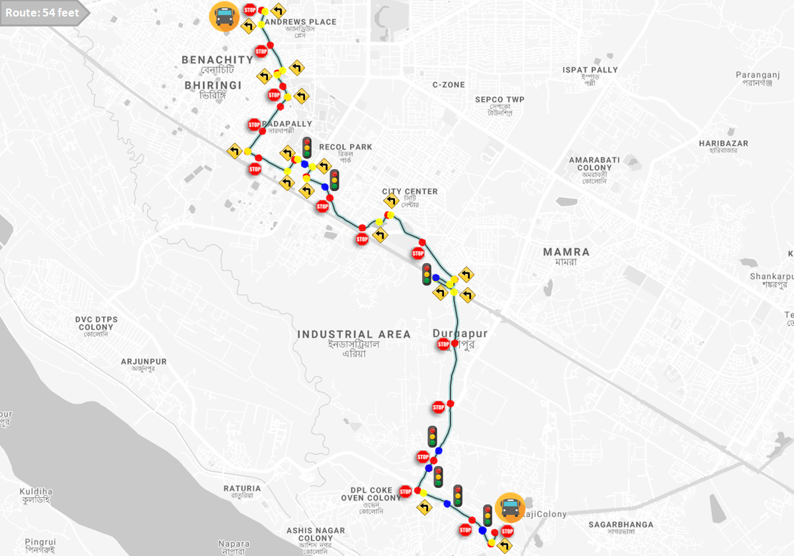

# Bus Trajectory Dataset
This dataset contains the bus trajectory dataset collected by 6 volunteers who were asked to travel across the sub-urban city of Durgapur, India, on intra-city buses (route name: 54 Feet). During the travel the volunteers captured sensor logs through an Android application installed on COTS smartphones. The details of the modalities logged by the Android application is given as follows.

<p align="center">
      
</p>

## Available Modalities

|    `Modality`       | `Sample Rate (Hz)` |      `File Pattern`       |
|:--------------------|:------------------:|:-------------------------:|
|    GPS              |        1           |All/Bus_GPS_\*.txt         |
|    Speed            |        1           |All/Bus_GPS_\*.txt         |
|    Altitude         |        1           |All/Bus_GPS_\*.txt         |
|    accelerometer    |        197         |All/Bus_ACC_\*.txt         |
|    Gyroscope        |        197         |All/Bus_GYR\*.txt          |
|    WiFi             |        8000        |All/Bus_WiFi_\*.txt        |
|    Light            |        5           |Light/Bus_LIGHT\*.txt      |
|    Sound            |        8000        |Sound/Bus_SOUND_\*.wav     |


## Known Issues with the Dataset
Some of the minor known probelms in the dataset are:
1. Some of the WiFi SSID(s) have characters replaced by unrecognised characters (or even emojis).
2. A suggested way of calculating the speed of the vehicle is by computing the difference in distance from the GPS coordinates and then checking the time taken to travel that distance. However, that would also include the stoppage time, if any.

## Dataset Link
[Download the dataset from here](https://iitkgpacin-my.sharepoint.com/:u:/g/personal/pkarmakar_kgpian_iitkgp_ac_in/EYXROxN9QzxIg-ts4qwDjdEBoEGRgHO07HggdEVjX4Ppng?e=LPxXjz)

# Reference
To refer this dataset, please cite the following work.

[Download the paper from here](https://dl.acm.org/doi/10.1145/3549548).

BibTex Reference:
```
@article{10.1145/3549548,
author = {Mandal, Ratna and Karmakar, Prasenjit and Chatterjee, Soumyajit and Spandan, Debaleen Das and Pradhan, Shouvit and Saha, Sujoy and Chakraborty, Sandip and Nandi, Subrata},
title = {Exploiting Multi-Modal Contextual Sensing for City-Bus’s Stay Location Characterization: Towards Sub-60 Seconds Accurate Arrival Time Prediction},
year = {2022},
publisher = {Association for Computing Machinery},
address = {New York, NY, USA},
issn = {2691-1914},
url = {https://doi.org/10.1145/3549548},
doi = {10.1145/3549548},
note = {Just Accepted},
journal = {ACM Trans. Internet Things},
month = {jul},
keywords = {multi-modal sensing, smartphone computing, intelligent transportation, stay-location detection, machine learning}
}
```
For questions and general feedback, contact Sujoy Saha (sujoy.saha@cse.nitdgp.ac.in).
